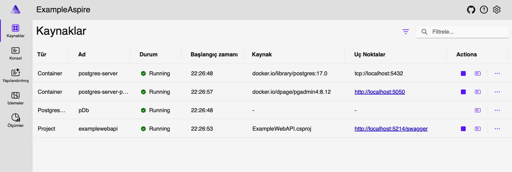
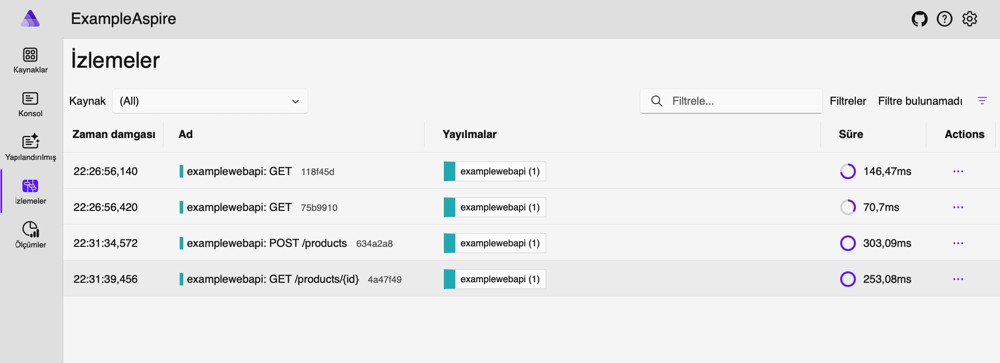

# .NET Aspire Nedir?
.NET Aspire, bulut tabanlı modern uygulamaların geliştirilmesini ve yönetilmesini kolaylaştıran bir orkestrasyon aracıdır. .NET ekosistemindeki mikroservis tabanlı mimarileri daha yönetilebilir ve ölçeklenebilir hale getirmek için geliştirilmiştir.

### Aspire Host Nedir?
Aspire Host, uygulamalarınızı çalıştırmak, yapılandırmak ve yönetmek için kullanılan bir ana bileşendir. Uygulama içindeki servislerin birbirleriyle nasıl iletişim kuracağını belirler ve dış bağımlılıkları (Redis, PostgreSQL gibi) yönetir.

## Avantajları
- **Kolay Orkestrasyon:** Mikroservislerin yönetilmesini ve birbirleriyle haberleşmesini kolaylaştırır.
- **Entegre Servis Yönetimi:** Veritabanları, önbellekleme servisleri gibi bağımlılıkları Aspire içinden yönetebilirsiniz.
- **Kolay Geliştirme ve Debug Desteği:** .NET ortamında geliştirme sürecini hızlandırır.
- **Konfigürasyon Kolaylığı:** YAML ve C# kodlarıyla yapılandırılabilir.

## Kod Örneğinde Ne Yapılacak?
Bu örnekte, .NET Aspire kullanarak bir Web API uygulamasını PostgreSQL ile ayağa kaldıracağız. Aspire, bu servisleri yönetecek ve bağlantılarını düzenleyecek.

## Code Structure

```plaintext
AspireExampleProject/
├── ExampleAspire.AppHost/       # Aspire host uygulaması
│   ├── Program.cs       # Aspire ana uygulaması
├── ExampleWebAPI/       # Örnek Web API servisi
│   ├── Program.cs       # Web API'nin giriş noktası
│   ├── appsettings.json # Konfigürasyon dosyası
└── docker-compose.yml   # Docker Compose ile bağımsız servislerin yönetimi
```

## Aspire Uygulaması Nasıl Tanımlanır?
Aşağıdaki kod bloğu ile PostgreSQL ve AppHost configlerini Aspire içinde tanımlıyoruz:

```csharp
var builder = DistributedApplication.CreateBuilder(args);

builder.Services.AddLogging(logging =>
{
    logging.ClearProviders();
    logging.AddConsole(); // Konsola loglama ekle
});

var configuration = builder.Configuration;
var postgresConfig = configuration.GetSection("Postgres");

var username = builder.AddParameter("postgresuser", secret: true);
var password = builder.AddParameter("postgrespassword", secret: true);

var postgresServer = builder.AddPostgres(
    name: "postgres-server",
    userName: username,
    password: password,
    port: 5432
).WithHealthCheck();

var postgreAdmin = postgresServer
                        .WithPgAdmin(c => c.WithHostPort(5050)
                        .WaitFor(dependency: postgresServer));


var postgresProductDb = postgresServer.AddDatabase("pDb", databaseName: "ProductDb");

builder.AddProject<Projects.ExampleWebAPI>("examplewebapi")
    .WithReference(postgresProductDb)
    .WithEnvironment("ConnectionStrings__DefaultConnection", builder.Configuration.GetConnectionString("DefaultConnection"))
    .WaitFor(dependency: postgresServer);

builder.Build().Run();
```

Bu kod parçası, Aspire ile PostgreSQL'i içeren bir uygulama oluşturur ve Web API servisine bu servislerin bağlantı bilgilerini otomatik olarak aktarır.


## Docker compose üzerinde AppHost'u kullanmak istersek ne yapmalıyız?

- **Aspirate (Aspir8):** YAML dosyasını generate etmek için kullanılan bir tool. AppHost dosyanızda çalıştırdığınız zaman Program.cs içerisinde yapmış olduğunuz konfigürasyonları YAML dosyası haline getirip derler.
Github link: [Aspirate](https://github.com/prom3theu5/aspirational-manifests)

- **Docker Compose:** Projenizde mevcut bir docker compose dosyanız varsa bu kısmı bozmak istemezseniz aşağıdaki gibi ekleyebilirsiniz.

```yaml
version: '3.9'

networks:
  aspire-network:
    driver: bridge

services:
  aspire-dashboard:
    image: mcr.microsoft.com/dotnet/aspire-dashboard:9.0
    container_name: aspire-dashboard
    environment:
        DOTNET_DASHBOARD_UNSECURED_ALLOW_ANONYMOUS: "true"
    ports:
      - "18888:18888"
      - "4317:18889"
    networks:
      - aspire-network
    depends_on:
      - postgres
      - redis
      - rabbitmq

  examplewebapi:
    image: ${DOCKER_REGISTRY-}examplewebapi
    build:
      context: .
      dockerfile: ExampleWebAPI/Dockerfile
    environment:
      - ASPNETCORE_ENVIRONMENT=Development
      - OTEL_DOTNET_EXPERIMENTAL_OTLP_EMIT_EXCEPTION_LOG_ATTRIBUTES=true
      - OTEL_DOTNET_EXPERIMENTAL_OTLP_EMIT_EVENT_LOG_ATTRIBUTES=true
      - OTEL_DOTNET_EXPERIMENTAL_OTLP_RETRY_ENABLED=true
      - ASPNETCORE_FORWARDEDHEADERS_ENABLED=true
      - HTTP_PORTS=5000
      - OTEL_EXPORTER_OTLP_ENDPOINT=http://aspire-dashboard:18889
      - OTEL_SERVICE_NAME=example-webapi
      - ConnectionStrings__DefaultConnection=Host=postgres;Database=ProductDb;Username=postgres;Password=postgrespassword
    ports:
      - "5000:5000"
    networks:
      - aspire-network
    depends_on:
      - aspire-dashboard
```

## Sonuç
.NET Aspire, modern .NET uygulamalarını kolayca yönetmek ve dağıtmak için güçlü bir çözümdür. Bu örnek, temel bir Aspire projesinin nasıl oluşturulacağını ve bağımlılıkların nasıl yönetileceğini göstermektedir. Daha ileri seviye senaryolarda, Kubernetes ve Docker Compose entegrasyonlarıyla ölçeklenebilir mimariler tasarlamak mümkündür.

### **NOT:** Instrumentation özellikleri kullanılarak trace'ler detaylandırılabilir!!!

### Aspire Dashboard



## Traces



## Kaynakça

- Gençay Yıldız: https://www.gencayyildiz.com/blog/net-aspire-nedir-nasil-kullanilir-detaylica-inceleyelim/

- Aspirate: https://github.com/prom3theu5/aspirational-manifests